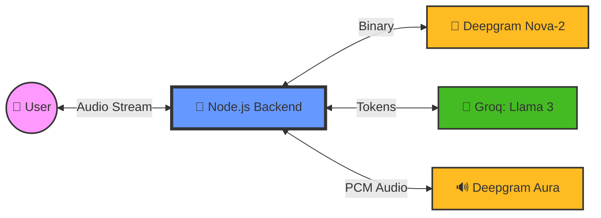

# 🎙️ AI Voice Agent: Ultra-Low Latency Conversational AI

A production-ready, real-time AI Voice Agent built with a high-performance streaming pipeline. This agent achieves human-like conversational speeds (<800ms) by piping audio and text through a high-speed WebSocket loop.

---

## 🏗️ System Architecture

The agent operates on a continuous streaming loop to minimize "Time to First Byte" (TTFB).



### ⚡ The "Super-Speed" Tech Stack
*   **STT (Deepgram Nova-2)**: Converted raw audio to text in <300ms.
*   **LLM (Groq / Llama 3.1)**: Leveraging LPUs for near-instant token generation (fallback to OpenAI GPT-4o-mini).
*   **TTS (Deepgram Aura)**: A high-fidelity, low-latency text-to-speech engine designed specifically for conversational AI.
*   **Transport (Socket.io)**: Full-duplex binary streaming for raw PCM audio and transcripts.

---

## ✨ Key Features

-   **Real-Time Streaming**: No waiting for full sentences. Audio is processed and played in tiny chunks.
-   **Barge-in Support**: The agent stops speaking immediately if the user interrupts.
-   **Smart Deduplication**: Prevents the agent from responding twice to the same transcript.
-   **Resilient Connections**: Automatic re-connection for STT/TTS WebSockets to prevent session timeouts.
-   **Modern UI**: Glassmorphic React interface with live transcript visualization and sound-wave indicators.

---

## 🛠️ Project Structure

```text
AI_Voice_Agent/
├── backend/
│   ├── services/
│   │   ├── stt.js      # Deepgram Transcription logic
│   │   ├── llm.js      # Groq/OpenAI Orchestration
│   │   └── tts.js      # Deepgram Aura Speech synthesis
│   └── server.js       # Socket.io Orchestrator
└── frontend/
    ├── src/
    │   ├── hooks/      # Audio recording & playback logic
    │   └── App.jsx     # Main UI & Event handlers
    └── index.html
```

---

## 🚀 Getting Started

### 1. Prerequisites
You will need API keys for:
-   [Deepgram](https://console.deepgram.com) (For STT & TTS)
-   [Groq](https://console.groq.com) (For ultra-fast LLM)
-   [OpenAI](https://platform.openai.com) (Optional fallback)

### 2. Backend Setup
```bash
cd backend
npm install
cp .env.example .env # Add your keys here
npm run dev
```

### 3. Frontend Setup
```bash
cd frontend
npm install
npm run dev
```

---

## 🌐 Deployment

### Backend (Node.js)
Deploy to **Render**, **Railway**, or **Fly.io**. 
*   **Note**: Ensure your hosting provider supports WebSockets (sticky sessions).
*   **CORS**: Update the `origin` in `server.js` to your frontend URL.

### Frontend (React)
Deploy to **Vercel** or **Netlify**.
*   Update the `BACKEND_URL` in `App.jsx` to your deployed backend address.

---

## 🛡️ License
ISC License. Feel free to use this as a blueprint for your own Voice AI applications!